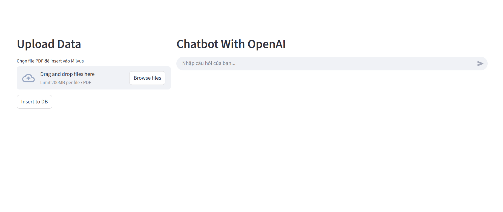
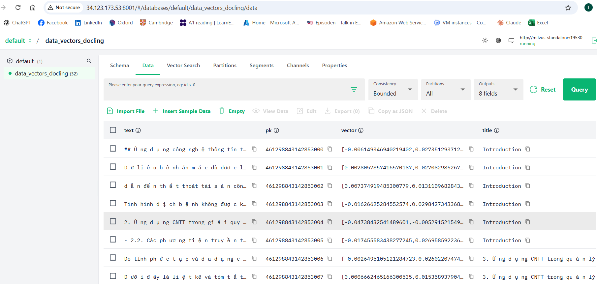
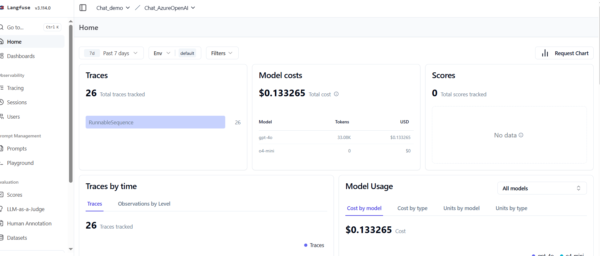

# 🤖 Chatbot using RAG flow  
[👉 README_VI](./README_vi.md)
## 📌 Diagram  
  

---

## 🖥️ Prepare server  
You can choose the runtime environment depending on your needs:  

- **Option 1: RAG with vLLM**  
  + Minimum GPU: **16GB VRAM**  
  + RAM: **16GB**  
  + OS: **Ubuntu 20.04 / 22.04** (recommended for easier setup)  

- **Option 2: RAG with existing LLM (OpenAI, Azure, …)**  
  + No GPU required  
  + RAM: **8GB**  
  + OS: **Ubuntu 20.04 / 22.04**  

---

## 📂 Prepare data  
- Place your **PDF files** in the folder:  ```./pdf_data/```

# 🚀 Init environment

```bash
# Create virtual env
python3 -m venv env_chat

# Activate environment (Ubuntu)
source env_chat/bin/activate
```

# 🚀 Run application

```bash
# Start vector DB (Milvus):
cd vectorstores
sudo docker compose up -d

# Chunk data:
python3 prepare_vector_db.py

# Run aplication
sudo docker compose up -d
```
### UI Test. You can open : ```http://<your IP>:8501/```  


### If you wanna view data in DBvector. You can open : ```http://<your IP>:8001/```  
  

### If you wanna trace process LLM model.You using Langfuse 
  