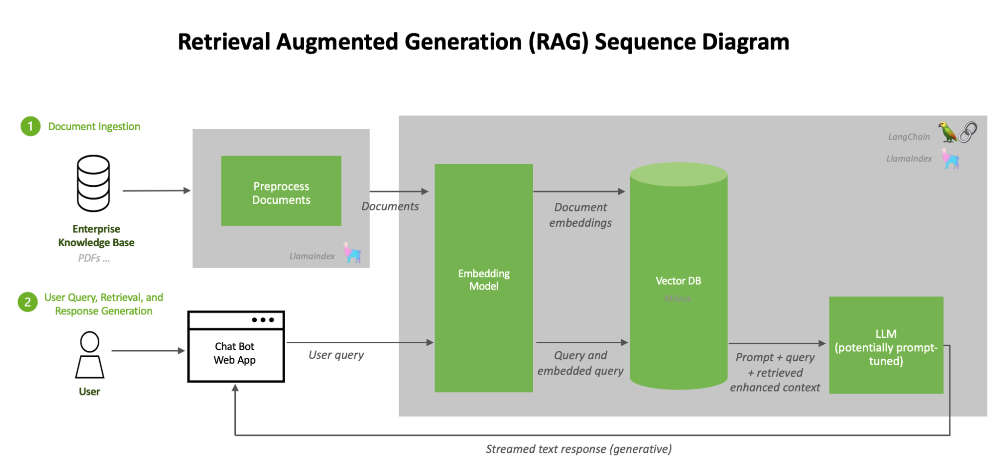

# 🤖 Chatbot using RAG flow  

## 📌 Diagram  
  

---

## 🖥️ Prepare server  
Bạn có thể lựa chọn môi trường chạy theo nhu cầu:  

- **Option 1: RAG với vLLM**  
  + GPU tối thiểu **16GB VRAM**  
  + RAM: **16GB**  
  + OS: **Ubuntu 20.04 / 22.04** (khuyến nghị để dễ cài đặt)  

- **Option 2: RAG với LLM có sẵn (OpenAI, Azure, …)**  
  + Không cần GPU  
  + RAM: **16GB**  
  + OS: **Ubuntu 20.04 / 22.04**  

---

## 📂 Prepare data  
- Dữ liệu dạng **PDF** được đặt tại folder:  ```./pdf_data/```

# 🚀 Init môi trường

```bash
# Tạo virtual env
python3 -m venv env_chat

# Kích hoạt môi trường (Ubuntu)
source env_chat/bin/activate
```

# 🚀 Run chương tình

```bash
# Khởi tạo DB vector(Milvus):
sudo docker compose up -d

# Chunk data:
python3 prepare_vector_db.py

# Run aplication
streamlit run app.py